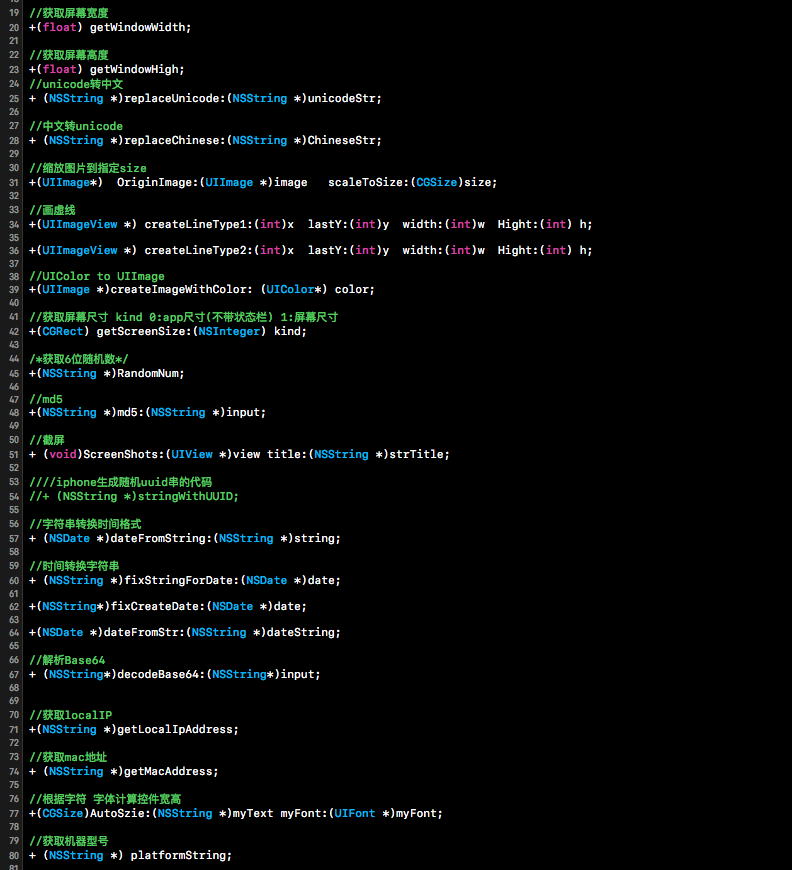
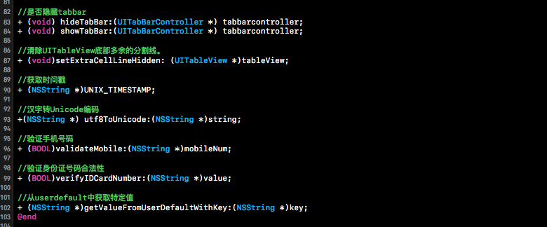
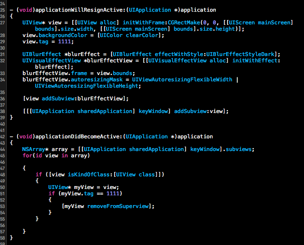

# LittleTools
LittleTools For iOS development

##	GeneralTools
Tools that are commonly used

* Usage
	*	1: Drag to your own Xcode Project
	*	2: Add a birdge header if you are using swift
	*	3: Include it when you want to use it

## BlurBackStage

*  Usage

## HelloCpp
A demo to show how to use C/C++ file in Xcode

* Usage
	1.	Creat C++ files named Greeting
	2.	Change ViewController.m to ViewController.mm to tell Xcode that ViewController wants to mix Objective-c with C++