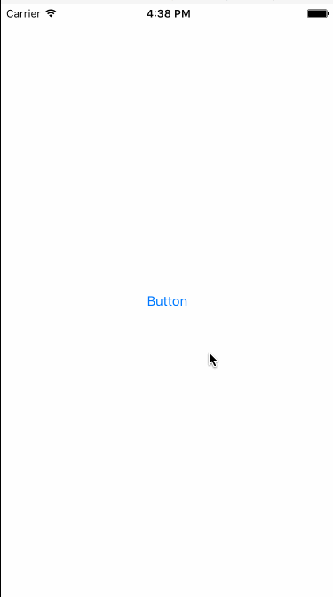

# LittleTools
LittleTools For iOS development

##Third-Party
*	Reachability.swift
	*	[Github](https://github.com/ashleymills/Reachability.swift)
	*	Example
	
```Swift
	let reachability: Reachability
do {
    reachability = try Reachability.reachabilityForInternetConnection()
} catch {
    print("Unable to create Reachability")
    return
}


reachability.whenReachable = { reachability in
    // this is called on a background thread, but UI updates must
    // be on the main thread, like this:
    dispatch_async(dispatch_get_main_queue()) {
        if reachability.isReachableViaWiFi() {
            print("Reachable via WiFi")
        } else {
            print("Reachable via Cellular")
        }
    }
}
reachability.whenUnreachable = { reachability in
    // this is called on a background thread, but UI updates must
    // be on the main thread, like this:
    dispatch_async(dispatch_get_main_queue()) {
        print("Not reachable")
    }
}

do {
    try reachability.startNotifier()
} catch {
    print("Unable to start notifier")
}
```
##	GeneralTools
Tools that are commonly used


* Usage
	*	1: Drag to your own Xcode Project
	*	2: Add a birdge header if you are using swift
	*	3: Include it when you want to use it

## BlurBackStage


*  Usage


## HelloCpp
A demo to show how to use C/C++ file in Xcode



* Usage
	1.	Creat C++ files named Greeting
	2.	Change ViewController.m to ViewController.mm to tell Xcode that ViewController wants to mix Objective-c with C++
	